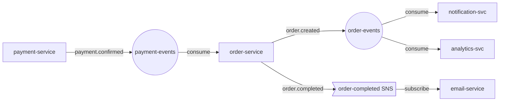

# Event-Driven Architecture Discovery

This skill helps you research and map the event-driven architecture across JET's ecosystem. It is JET-internal and requires access to JET infrastructure (GitHub Enterprise, BigQuery, Backstage, Datadog, Jira, Confluence). It combines GitHub code search, BigQuery metadata queries, Backstage catalog lookups, Datadog log/APM analysis, and Jira/Confluence documentation searches to identify producers, consumers, topics, queues, and message flows -- then presents findings as structured summaries, tables, and architecture diagrams.

## Required Skills

This skill depends on four other JET skills for deep integration with GitHub, BigQuery, Datadog, and Google Drive. They provide the foundational knowledge for CLI usage, query patterns, authentication, and best practices that this skill builds on.

| Skill | Purpose | What it provides |
|---|---|---|
| **jet-company-standards** | GitHub Enterprise (`gh`) + Backstage API | GHE auth, `gh` hostname handling, Backstage search patterns, service/team lookups |
| **jet-bq** | BigQuery (`bq`) CLI | BQ auth, query patterns, cost estimation, dry-run practices, project switching |
| **jet-datadog** | Datadog Pup CLI (`pup`) | Pup auth, log/metrics/APM queries, Flex Logs storage, EU site config |
| **jet-google-sheets** | Google Sheets + Drive search (`sheets-cli`) | Drive search for spreadsheets, reading/writing sheet data, OAuth setup |

**Before using this skill, verify that the required skills are installed.** Check whether `jet-company-standards`, `jet-bq`, `jet-datadog`, and `jet-google-sheets` appear in your available skills list. If any are missing, install them:

```bash
npx skills add git@github.je-labs.com:ai-platform/skills.git --skill jet-company-standards
npx skills add git@github.je-labs.com:ai-platform/skills.git --skill jet-bq
npx skills add git@github.je-labs.com:ai-platform/skills.git --skill jet-datadog
npx skills add git@github.je-labs.com:ai-platform/skills.git --skill jet-google-sheets
```

After installing, restart your agent so the new skills are loaded.

When using the discovery layers below, defer to the installed skills for tool-specific details:
- For `gh` commands and Backstage API calls, follow the conventions from **jet-company-standards** (especially GHE hostname handling and Backstage auth setup).
- For `bq` queries, follow the conventions from **jet-bq** (especially dry-run before execution, cost awareness, and Standard SQL).
- For `pup` commands, follow the conventions from **jet-datadog** (especially `--storage=flex`, `DD_SITE=datadoghq.eu`, and query syntax).
- For Google Drive/Sheets searches, follow the conventions from **jet-google-sheets** (especially `sheets-cli` authentication and command syntax).
- For `acli` (Jira) and `confluence-cli` (Confluence) commands, follow the conventions from **jet-company-standards** (especially `--json --fields="*all"` on all Jira reads, and `confluence-cli` page reading workflows).

## Prerequisites

- **GitHub CLI (`gh`)** authenticated against JET GitHub Enterprise (`github.je-labs.com`) -- see **jet-company-standards** skill
- **Google Cloud SDK (`bq`)** with access to the `just-data-bq-users` GCP project -- see **jet-bq** skill
- **Backstage API key** set as `$BACKSTAGE_API_KEY` -- see **jet-company-standards** skill
- **Datadog Pup CLI (`pup`)** authenticated against JET's EU Datadog site -- see **jet-datadog** skill
- **Sheets CLI (`sheets-cli`)** authenticated with Google OAuth (requires Google Drive API enabled) -- see **jet-google-sheets** skill
- **Atlassian CLI (`acli`)** authenticated against JET Jira Cloud -- see **jet-company-standards** skill
- **Confluence CLI (`confluence-cli`)** authenticated against JET Confluence Cloud (`justeattakeaway.atlassian.net`) -- see **jet-company-standards** skill
- **jq** for JSON processing

Verify access before starting:

```bash
# GitHub Enterprise
gh auth status --hostname github.je-labs.com

# BigQuery
bq ls --project_id just-data-bq-users

# Backstage
curl -s -H "Authorization: Bearer $BACKSTAGE_API_KEY" \
  "https://backstagebackend.eu-west-1.production.jet-internal.com/api/search/query?term=test" \
  | jq '.results | length'

# Datadog
export DD_SITE=datadoghq.eu
pup auth status

# Google Drive / Sheets CLI
sheets-cli auth status

# Jira (Atlassian CLI)
acli jira auth

# Confluence
confluence search "test" --limit 1
```

## Discovery Strategy

When a user asks about event-driven architecture, follow this layered approach. Start broad and narrow down based on what you find. Not every question requires all layers -- use judgment.

### Layer 1: Backstage Catalog (Service Ownership & Metadata)

Start here to understand what services exist, who owns them, and how they're cataloged. This gives you the organizational context before diving into code. Search for Components (services) and APIs (including AsyncAPI event contracts) related to the event or topic name.

See [references/backstage-patterns.md](references/backstage-patterns.md) for the full set of Backstage API patterns including service search, AsyncAPI discovery, owner lookups, team queries, system/domain lookups, and pagination.

### Layer 2: GitHub Code Search (Producers & Consumers)

This is the core discovery mechanism. Search across all JET repos for code patterns that indicate producing or consuming messages. The reference file contains a complete catalog organized by messaging platform (Kafka, SNS, SQS, RabbitMQ, Redpanda) and language (Java/Kotlin, .NET, Python, Go, Node.js/TypeScript), with tables of search patterns, roles (producer/consumer/config), and ready-to-run `gh search code` commands.

Key techniques:
- Search for **platform-specific patterns** (e.g., `KafkaTemplate`, `@KafkaListener`, `sns.publish`, `SQSEvent`, `RabbitTemplate`) to find producer and consumer code
- Search for **topic/queue names** directly when the user asks about a specific event -- search for naming variants (PascalCase, kebab-case, snake_case) since these are different strings
- When you find a match, **read the file** to extract the actual topic or queue name: `gh api repos/OWNER/REPO/contents/PATH --hostname github.je-labs.com | jq -r '.content' | base64 -d`

See [references/github-search-patterns.md](references/github-search-patterns.md) for the full catalog of patterns.

### Layer 3: BigQuery Metadata (Telemetry & Historical Data)

Query BigQuery for metadata about event-driven systems. The `just-data-bq-users` project contains datasets where **the event name is always part of the table name** (e.g., a table named `myevent` or `my_event` for the `MyEvent` event). Columns like `RaisingComponent` or `SourceService` identify the producing service.

Use `bq ls` to discover datasets, `bq show --schema` to inspect columns, and `bq query` to sample data. Always dry-run expensive queries first.

See [references/bq-discovery-queries.md](references/bq-discovery-queries.md) for ready-to-use BigQuery queries.

### Layer 4: Infrastructure as Code

Search Terraform, CloudFormation, and Helm charts for topic/queue/subscription declarations. IaC definitions are the most reliable source of truth for what resources actually exist in production. Search for `aws_sns_topic`, `aws_sqs_queue`, `kafka_topic` in `*.tf` files and messaging config in `values.yaml`.

See the **Infrastructure as Code** section in [references/github-search-patterns.md](references/github-search-patterns.md) for the full set of Terraform and Helm search patterns.

### Layer 5: Datadog Logs & APM (Runtime Evidence)

The previous layers show what the code *declares*. Datadog shows what's actually happening at runtime -- which services are actively producing/consuming messages, error rates, throughput, and consumer lag. This is especially valuable for validating findings from code search and catching services that use dynamic or abstracted messaging patterns.

Always set `DD_SITE=datadoghq.eu` and use `--storage=flex` for all log queries -- JET stores logs in Flex Logs.

Key techniques:
- **Aggregate by service** to discover which services interact with a topic: `pup logs aggregate --query="TOPIC_NAME" --from=24h --compute="count" --group-by="service" --storage=flex`
- **Search for errors** to find messaging failures: `pup logs search --query="status:error AND (kafka OR sqs OR sns)" --from=1h --limit=20 --storage=flex`
- **Check consumer lag** and queue depth via metrics: `pup metrics query --query="avg:kafka.consumer.lag{*} by {consumer_group,topic}" --from=1h`
- **Use APM** to discover async service dependencies: `pup apm services list --env=prod`

See [references/datadog-patterns.md](references/datadog-patterns.md) for the full catalog of Kafka, SNS/SQS, RabbitMQ, error investigation, consumer health, throughput, and APM query patterns.

### Layer 6: Google Drive & Backstage TechDocs (Documentation)

Code and runtime data don't always tell the full story. Teams often document their event-driven architecture in spreadsheets (topic registries, event catalogs, integration matrices) and TechDocs pages (design docs, ADRs, runbooks).

- **Google Drive**: Use `sheets-cli sheets find --name "SEARCH_TERM"` to find spreadsheets by name (case-insensitive). Search for topic registries, event catalogs, and service-specific docs. Then read with `sheets-cli table read --spreadsheet ID --sheet "Sheet1"`.
- **Backstage TechDocs**: Search with `curl -s -H "Authorization: Bearer $BACKSTAGE_API_KEY" "https://backstagebackend.eu-west-1.production.jet-internal.com/api/search/query?term=SEARCH_TERM&types%5B0%5D=techdocs"`. Always truncate `.document.text[:150]` in jq output.

See [references/drive-techdocs-patterns.md](references/drive-techdocs-patterns.md) for the full set of Google Drive and TechDocs search patterns, reading workflows, and jq snippets.

### Layer 7: Jira & Confluence (Tickets, Design Docs, ADRs)

Teams document event-driven architecture decisions, incident investigations, and integration plans in Jira tickets and Confluence pages. This layer surfaces PI tickets, design docs, ADRs, and migration plans that reference specific events or topics.

- **Jira** (`acli`): Use JQL `text ~ "EVENT_NAME"` to search tickets (case-insensitive). Always include `--json --fields="*all"`. PI tickets (`project = PI`) are especially high-signal -- root cause analysis sections name specific producers, consumers, and failure points.
- **Confluence** (`confluence-cli`): Use `confluence search "EVENT_NAME"` for full-text search (case-insensitive), `confluence find "TITLE"` for title search, and `confluence read PAGE_ID --format markdown` to read pages.

Follow cross-references between Jira and Confluence -- tickets often link to design docs, and vice versa.

See [references/jira-confluence-patterns.md](references/jira-confluence-patterns.md) for the full set of JQL queries, Confluence search patterns, and investigation workflows.

## Narrowing Your Search

The broad searches above may return many results. Use these techniques to focus:

### By organization or repo

```bash
# Search within a specific org
gh search code "KafkaTemplate" --hostname github.je-labs.com --owner ORG_NAME -L 20

# Search within a specific repo
gh search code "KafkaTemplate" --hostname github.je-labs.com -R OWNER/REPO -L 20
```

### By file type

```bash
# Only Java files
gh search code "KafkaTemplate" --hostname github.je-labs.com --filename "*.java" -L 20

# Only Terraform
gh search code "aws_sns_topic" --hostname github.je-labs.com --filename "*.tf" -L 20

# Only config files
gh search code "bootstrap.servers" --hostname github.je-labs.com --filename "*.yml" -L 20
```

### By specific topic name

When the user asks about a specific topic, search for it directly. GitHub code search is case-insensitive by default, so a single search covers all case variants (e.g., `OrderCreated`, `ordercreated`, `order_created`). However, also search for common casing/delimiter variants if the topic name could appear differently:

```bash
# Search for a specific topic name across all code (case-insensitive by default)
gh search code "my-topic-name" --hostname github.je-labs.com -L 30

# Also search for common naming variants (kebab-case, snake_case, PascalCase)
gh search code "my_topic_name" --hostname github.je-labs.com -L 30
gh search code "MyTopicName" --hostname github.je-labs.com -L 30
```

## Output Formats

Adapt the output format to the user's question. Use multiple formats when they help paint the full picture.

### Text Summary

Use when the user asks a simple question like "who produces X?" or "what does service Y consume?"

```
## Service: order-service
- **Owner:** order-management team
- **Produces:**
  - `order.created` (Kafka) -> order-events topic
  - `order.completed` (SNS) -> arn:aws:sns:eu-west-1:...:order-completed
- **Consumes:**
  - `payment.confirmed` (Kafka) <- payment-events topic
  - `inventory.reserved` (SQS) <- inventory-reservation-queue
```

### Structured Markdown Tables

Use when comparing multiple services or listing many topics:

```markdown
| Topic/Queue | Type | Producers | Consumers | Owner |
|---|---|---|---|---|
| order-events | Kafka | order-service | notification-svc, analytics-svc | order-management |
| payment-events | Kafka | payment-service | order-service, fraud-detection | payments-team |
| inventory-queue | SQS | inventory-api | warehouse-worker | supply-chain |
```

### Mermaid Architecture Diagrams

Use when the user wants to visualize message flow or understand the overall architecture:

````markdown

````

Use these shapes consistently:
- `[Service Name]` -- rectangle for services
- `((Topic Name))` -- circle for Kafka topics
- `>Queue Name]` -- asymmetric shape for SQS/queues
- `{Exchange}` -- diamond for RabbitMQ exchanges

## Investigation Workflows

### "What events does service X produce/consume?"

1. Search Backstage for the service to get its repo and owner
2. Clone or browse the repo via `gh api` to find messaging code
3. Extract topic/queue names from code and configuration
4. Query Datadog logs to confirm runtime activity: `pup logs aggregate --query="service:SERVICE_NAME AND (kafka OR sqs OR sns OR rabbitmq)" --from=24h --compute="count" --group-by="@topic" --storage=flex`
5. Cross-reference with BigQuery for throughput data if available
6. Search Google Drive for documentation: `sheets-cli sheets find --name "SERVICE_NAME"` and TechDocs: search Backstage TechDocs for the service name
7. Search Jira for related tickets: `acli jira workitem search --jql "text ~ \"SERVICE_NAME\" AND text ~ \"event\"" --json --fields="*all" --limit 10`
8. Search Confluence for architecture docs: `confluence search "SERVICE_NAME events" --limit 5`
9. Present findings as a text summary

### "Who produces/consumes topic Y?"

1. Search GitHub for the topic name across all repos
2. For each match, determine if it's a producer or consumer based on context
3. Validate with Datadog: `pup logs aggregate --query="TOPIC_NAME" --from=24h --compute="count" --group-by="service" --storage=flex`
4. Search Google Drive for spreadsheets mentioning the topic: `sheets-cli sheets find --name "TOPIC_NAME"` -- topic registries often list producers and consumers
5. Search Backstage TechDocs for the topic name to find design docs or event contracts
6. Search Jira for PI tickets or integration work: `acli jira workitem search --jql "text ~ \"TOPIC_NAME\"" --json --fields="*all" --limit 10` -- PI tickets reveal past incidents and the services involved
7. Search Confluence for design docs: `confluence search "TOPIC_NAME" --limit 5` -- look for architecture decision records, integration guides, and event contracts
8. Look up service owners in Backstage
9. Present as a markdown table

### "Show me the event flow for domain Z"

1. Search Backstage for all services in the domain/system
2. For each service, search GitHub for messaging patterns
3. Build a comprehensive map of producers, consumers, and topics
4. Cross-reference with IaC definitions for any additional topics
5. Validate active flows via Datadog: `pup logs aggregate --query="(kafka OR sqs OR sns) AND (service:svc-a OR service:svc-b)" --from=24h --compute="count" --group-by="service" --storage=flex`
6. Search Google Drive for architecture diagrams or integration matrices: `sheets-cli sheets find --name "DOMAIN_NAME"` or `sheets-cli sheets find --name "event flow"`
7. Search Backstage TechDocs for domain-level architecture docs
8. Search Confluence for domain architecture pages: `confluence search "DOMAIN_NAME event architecture" --limit 5`
9. Present as a Mermaid diagram with supporting tables

### "What messaging infrastructure exists for team T?"

1. Search Backstage for all components owned by the team
2. For each component, search code for messaging patterns
3. Search Terraform for topic/queue declarations
4. Check Datadog for active message flows across team services
5. Search Google Drive for team-maintained spreadsheets: `sheets-cli sheets find --name "TEAM_NAME"` -- teams sometimes maintain their own topic inventories
6. Search Backstage TechDocs for team documentation on their messaging setup
7. Search Jira for the team's project: `acli jira workitem search --jql "project = PROJ AND text ~ \"kafka OR sns OR sqs OR event\"" --json --fields="*all" --limit 20`
8. Search Confluence for team space docs: `confluence find "events" --space TEAM_SPACE` or `confluence search "TEAM_NAME messaging" --limit 5`
9. Present as structured tables grouped by service

### "Is topic Y healthy? Are there errors or lag?"

1. Search Datadog for errors related to the topic: `pup logs search --query="status:error AND TOPIC_NAME" --from=1h --limit=20 --storage=flex`
2. Check consumer lag metrics: `pup metrics query --query="avg:kafka.consumer.lag{topic:TOPIC_NAME} by {consumer_group}" --from=1h`
3. Check dead letter queue activity: `pup logs search --query="(dead_letter OR dlq) AND TOPIC_NAME" --from=1h --limit=10 --storage=flex`
4. Search TechDocs for known issues or runbooks related to the topic
5. Search Jira for recent PI tickets: `acli jira workitem search --jql "project = PI AND text ~ \"TOPIC_NAME\" AND created >= -30d" --json --fields="*all" --limit 5` -- recent incidents may explain current issues
6. Present health summary with error counts, lag trends, and recent incidents

### Cross-Validation

Before presenting final results, cross-validate findings across at least two independent sources. For example:
- A producer found via GitHub code search should be confirmed by Datadog runtime logs or BigQuery metadata
- A consumer found in IaC (Terraform subscription) should be verified with code search showing message handling logic
- Documentation claims (Confluence, TechDocs, Drive spreadsheets) should be checked against code or runtime evidence

When sources conflict, note the discrepancy and assign lower confidence. Mark findings as **high confidence** (2+ sources agree), **medium confidence** (single code/runtime source), or **low confidence** (documentation only or indirect evidence).

## Important Notes

- **Case-insensitive searching**: Always prefer case-insensitive searches across all tools. Event and topic names may appear in different cases across codebases (e.g., `MyEvent`, `myevent`, `MY_EVENT`, `my-event`). Specific guidance per tool:
  - **GitHub code search** (`gh search code` / `gh api /search/code`): GitHub's code search is case-insensitive by default for keywords. No special handling needed.
  - **Local grep/ripgrep**: Always use the `-i` flag (e.g., `rg -i "myevent"`) or case-insensitive regex `(?i)` patterns.
  - **BigQuery**: Use `LOWER()` for string comparisons (e.g., `WHERE LOWER(column) LIKE '%myevent%'`) or `REGEXP_CONTAINS(column, r'(?i)myevent')`.
  - **Backstage API**: The search `term` parameter is case-insensitive by default. The `jq` `test()` function requires the `"i"` flag for case-insensitive matching: `test("pattern"; "i")`.
  - **Datadog pup CLI**: Log search queries are case-insensitive by default for unstructured text. For attribute filters, use wildcard patterns or both cases.
  - **Google Drive / sheets-cli**: `sheets-cli sheets find --name` is case-insensitive by default.
- **GitHub search rate limits**: `gh search code` has rate limits. Space out requests if you get 403 errors. Use `-L` flag to control result count (default 30, max 100).
- **Partial picture**: Code search gives you a snapshot based on patterns. It won't catch dynamically constructed topic names or services that use custom messaging abstractions. Acknowledge this limitation in your output.
- **BigQuery cost awareness**: Always use `--dry_run` before running expensive queries. Default to `LIMIT 100` for exploratory queries. See [references/bq-discovery-queries.md](references/bq-discovery-queries.md) for cost-safe patterns.
- **Staleness**: GitHub search indexes may lag behind the latest commits. Note this when presenting findings.
- **Multiple messaging systems**: JET services may use a mix of Kafka, SNS/SQS, and RabbitMQ. Don't assume a single messaging platform -- search for all patterns unless the user specifies one.
- **Datadog Flex Logs**: Always use `--storage=flex` for log queries. JET stores the majority of logs in Flex Logs -- omitting this flag queries only indexed logs and will miss most data.
- **Datadog EU site**: Always ensure `DD_SITE=datadoghq.eu` is set. JET uses the EU Datadog site.
- **Datadog time ranges**: Use reasonable time ranges for log queries. Start with `--from=1h` for recent activity, expand to `--from=24h` or `--from=7d` if needed. Avoid very large ranges as they can be slow.
- **Combining sources**: Datadog provides runtime evidence that complements code search. If GitHub shows a service has Kafka code but Datadog shows no recent activity, the messaging may be deprecated or disabled. Conversely, Datadog may reveal messaging patterns not visible in code (e.g., infrastructure-level SNS/SQS wiring).
- **Google Drive limitations**: `sheets-cli sheets find` only searches for Google Sheets (spreadsheets). It cannot find Google Docs, Slides, or other Drive file types. Broaden your search terms if you get no results -- teams may name their spreadsheets differently than expected.
- **TechDocs text field**: Backstage TechDocs results include a `document.text` field that can be very long. Always truncate it in jq output (e.g., `.document.text[:150]`) to avoid flooding the terminal. Use the `location` field to construct a browsable URL instead.
- **Documentation may be outdated**: Spreadsheets and TechDocs pages may not reflect current architecture. Cross-reference documentation findings with code search and Datadog runtime data before treating them as authoritative.
- **Jira text search**: JQL `text ~ "term"` searches summary, description, and comments. It is case-insensitive by default. Always include `--json --fields="*all"` on all `acli jira workitem search` and `acli jira workitem view` commands to get structured output with all fields including custom fields.
- **Confluence search**: `confluence search "term"` performs a full-text search across all pages. It is case-insensitive by default. Use `confluence find "title"` to search by page title, optionally scoped to a space with `--space SPACEKEY`. Use `confluence read PAGE_ID --format markdown` to read page content.
- **Jira/Confluence are separate tools**: `acli` handles Jira only. `confluence-cli` handles Confluence only. They have separate authentication -- see **jet-company-standards** for setup of both.
- **PI tickets as evidence**: Production Incident (PI) tickets in Jira often contain detailed root cause analysis that names specific events, topics, and the services involved. Searching for `project = PI AND text ~ "EVENT_NAME"` is a high-signal way to discover consumers and producers that were involved in past incidents.

## Reference Material

- [GitHub Search Patterns](references/github-search-patterns.md) -- Complete catalog of code patterns for each messaging platform and language
- [BigQuery Discovery Queries](references/bq-discovery-queries.md) -- Ready-to-use BQ queries for event metadata
- [Backstage Lookup Patterns](references/backstage-patterns.md) -- Backstage API patterns for service and API discovery
- [Datadog Query Patterns](references/datadog-patterns.md) -- Pup CLI queries for runtime messaging discovery, error investigation, and throughput analysis
- [Drive & TechDocs Patterns](references/drive-techdocs-patterns.md) -- Google Drive spreadsheet search and Backstage TechDocs query patterns
- [Jira & Confluence Patterns](references/jira-confluence-patterns.md) -- JQL queries for event-related tickets, Confluence search for design docs and ADRs
